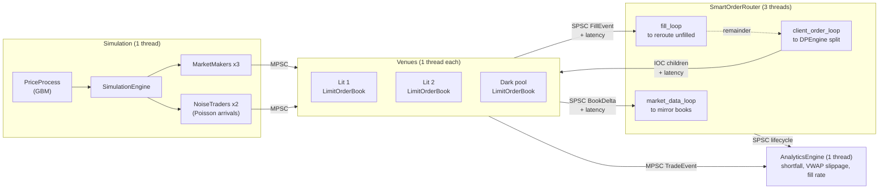

# High-Frequency Trading Smart Order Router

A multi-venue smart order router in C++20, benchmarked against two baselines inside an
agent-based market simulator.

The router splits a parent order across three venues (two lit exchanges and one dark pool)
by solving a dynamic program over expected execution cost, works the allocation as IOC child
orders, and reroutes whatever comes back unfilled. Venue link time is simulated on the wire,
not just priced in the cost function, so children arrive against books that have moved and
the DP sizes allocations against stale quotes.

Against proportional-by-displayed-size allocation, which is roughly what a simple production
router implements, the DP cuts implementation shortfall by 69% and fees by 25%. Both halves
of the hot path are measured with a calibrated `rdtsc` instrument that subtracts its own
noise floor: book operations at tens of nanoseconds, and the routing decision itself at
163 µs for a 10,000-share parent.

[](https://github.com/Hamz714/High-Frequency-Trading-Smart-Order-Router/actions/workflows/ci.yml)

---

## Results

150 Monte Carlo trials x 6 parent orders x 3 strategies (2,700 executions), venue latency
simulated. All three strategies run against the same seeded markets, so the routing decision
is the only variable.

| Metric | SOR (DP) | Proportional | Naive | vs. Proportional | vs. Naive |
|---|---:|---:|---:|---:|---:|
| Implementation shortfall (bps) | **5.83** | 18.96 | 22.21 | **-69.3%** | **-73.8%** |
| VWAP slippage (bps) | **6.40** | 17.12 | 22.97 | **-62.6%** | **-72.1%** |
| Fill rate (%) | **99.36** | 90.64 | 90.55 | **+8.73 pp** | **+8.81 pp** |
| Total fees ($) | **1703.89** | 2279.68 | 2610.65 | **-25.3%** | **-34.7%** |

Proportional landing between the other two on every metric is the sanity check: it beats
naive because splitting by displayed size avoids running a single venue's book, and loses to
the DP because it cannot see fees, the convexity of impact, or the dark pool.

Raw per-order data: [`results/baseline/sor_vs_baselines.csv`](results/baseline/sor_vs_baselines.csv).
Reproduce with `./high_frequency --trials 150`.

---

## How the routing decision works

Given `N` lots and `V` venues, choose the allocation vector minimising total expected cost.
A greedy sweep is wrong here because venue cost is non-linear in size: impact grows
quadratically, so the marginal cost of the 500th share on a venue is not the cost of the
first. The router solves the allocation exactly with a dynamic program.

`dp[k][n]` is the minimum expected cost of placing `n` lots across the first `k` venues:

```
dp[k][n] = min over x in [0, n] of ( cost_k(x) + dp[k-1][n-x] )
```

**Lit venue cost**: half-spread, quadratic impact against visible liquidity, per-share fees,
and a latency penalty.

```
cost = half_spread*q  +  impact_coef*q^2/visible_liquidity  +  fee*q  +  latency_us*lambda
```

**Dark venue cost**: an expectation over fill probability, where the miss branch costs what
it would take to fill that quantity on the lit book instead, plus a delay penalty. Fill
probability decays exponentially in size.

```
p_fill = historical_fill_ratio * exp(-decay_rate * q)
cost   = p_fill*(fee*q + latency)  +  (1 - p_fill)*(dp_lit[q] + lambda*q)
```

Lit venues are solved first because the dark miss branch needs a completed `dp_lit` table to
price against.

The four cost terms are not comparable in magnitude, and the formula hides that. `half_spread`
is in integer ticks while `fee_per_share` is in dollars, so on a 5,000-share slice the impact
term is worth tens of thousands of cost units, the spread term roughly ten thousand, latency
a few hundred, and fees about two. The DP is an impact-minimising splitter; fees and latency
break ties rather than drive the allocation.

Complexity is `O(V * W^2)` for `W = N/lot_size + 1`. The tables are flattened to row-major
arrays and the previous row is pre-reversed, so the inner loop walks two arrays forward
instead of one forward and one backward.

### Baselines

**Proportional by displayed size** is the fair comparison. It splits the parent across lit
venues in proportion to the size each displays at or better than the limit price
(largest-remainder apportionment over lots, sub-lot remainder to the deepest venue), then
reroutes unfilled quantity exactly as the other arms do. It is liquidity-aware and close to
what a simple production router does, but blind to fees, impact convexity, and the dark pool.

**Naive** sends the whole parent to the venue showing the best price. It is an isolator
rather than a competitor: the crudest possible decision rule against the same seeded market,
which bounds how much of the improvement is attributable to routing at all.

---

## Latency is simulated, not just priced

The cost function charges each venue `latency_us * lambda`. That term is a free parameter
fitted to nothing unless the simulator makes slow venues actually slow, so each venue's
`latency_us` is enforced as a one-way link time on three legs:

| Leg | Mechanism | Consequence |
|---|---|---|
| Router to venue | [`Venue::route_order`](src/lob/Venue.cpp) stamps an arrival time and the venue worker parks the order in a delay queue until it comes due | IOC children arrive against a book that has moved since the decision |
| Venue to router, market data | `BookDelta` carries a `visible_ns`; [`market_data_loop`](src/sor/SmartOrderRouter.cpp) will not apply it to the mirror books before then | The DP sizes allocations against quotes one latency stale |
| Venue to router, fills | `FillEvent` carries the same stamp, held by [`fill_loop`](src/sor/SmartOrderRouter.cpp) | The reroute cascade fires a full round trip late |

Market makers and noise traders are not delayed. `latency_us` models the router's link to a
venue; those agents are that venue's own local liquidity. The delay queue is what stops an
in-flight router order from head-of-line blocking them, and a test pins that.

Arrival times are wall-clock `steady_clock` nanoseconds rather than simulation-clock ticks.
The sim clock advances in 1 ms steps while the venue latencies are 202 / 46 / 71 µs, all
sub-tick, so enforcing against it would round every venue to the same 0 to 1 ticks and
destroy the ordering the DP's latency term ranks on.

The delay is visible in end-to-end tick-to-trade, which is measured independently of the
latency model: switching simulation on moves SOR p50 from 217 µs to 574 µs and naive p50 from
55 µs to 436 µs, both shifts landing near the 404 µs round trip to the venue the flow
concentrates on. Execution quality itself does not move, for a structural reason: this
simulator has no informed flow, so a stale quote is as likely to be stale in the router's
favour as against it. Latency here is symmetric price risk, not adverse selection. Modelling
flow whose arrival correlates with the price process's next move is the prerequisite for the
latency term to earn its keep. `--no-latency` disables the simulation while leaving the cost
function untouched, which makes that A/B directly measurable.

---

## Architecture

Every component runs on its own thread and communicates through bounded lock-free ring
buffers. Nothing on a hot path takes a lock; the router's mirror books are guarded by a
`shared_mutex` held briefly by readers.



Eight threads per trial, spawned and joined fresh each run. The three edges marked
*+ latency* are held for that venue's configured link time.

| Component | Role |
|---|---|
| [`LimitOrderBook`](src/lob/LimitOrderBook.cpp) | Price-time priority book, hybrid ladder plus overflow map |
| [`Venue`](src/lob/Venue.cpp) | Owns a book, matches on its own thread, publishes deltas and fills, holds inbound router orders for its link time |
| [`DPEngine`](src/sor/DPEngine.cpp) | The allocation dynamic program and both baseline split rules |
| [`SmartOrderRouter`](src/sor/SmartOrderRouter.cpp) | Mirror books, parent/child lifecycle, reroute cascade |
| [`AnalyticsEngine`](src/analytics/AnalyticsEngine.cpp) | Execution quality metrics, off the hot path |
| [`SPSCQueue`](include/common/SPSCQueue.h) / [`MPSCQueue`](include/common/MPSCQueue.h) | Bounded lock-free ring buffers with drop counters |
| [`SimulationEngine`](src/sim/SimulationEngine.cpp) | Drives a virtual clock, market makers, and noise traders |
| [`MonteCarloHarness`](src/harness/MonteCarloHarness.cpp) | Runs every arm over identical seeded markets |

Queue depth is a per-role value in [`SimConfig`](src/config/SimConfig.cpp) rather than a
global constant: `analytics_trade` carries every trade three venues publish across a whole
trial and is sized at 262,144, while a router fill queue drains on a dedicated thread and
needs 16,384. Both ring buffers round capacity up to a power of two at construction and hold
one heap allocation for their lifetime, so the hot path is an `& mask` rather than a modulo.
Venue order pools start at 65,536 orders and double on demand. That is roughly 30 MB of ring
buffers and 8 MB of order pools per trial, allocated once and untouched by an allocator
afterwards.

### Order book design

Real books cluster almost all activity within a few ticks of the touch, so this one uses a
256-tick circular ladder of fixed-size price levels around the touch plus a `std::map`
overflow region for everything outside that window. Ladder occupancy is tracked by a
four-word `uint64_t` bitmask, so finding the next non-empty level is a
`std::countr_zero`/`std::countl_zero` on a 64-bit word rather than a tree walk. Using the
standard spelling rather than a GCC builtin is what lets the same source compile under MSVC
and lower to a bit-scan on all three CI compilers. Orders live in a slab with intrusive
prev/next indices, so cancels are O(1) unlinks with no allocation.

**The window is 256 ticks because that is what keeps it in L1d.** `PriceLevel` is 24 bytes,
so one side of the ladder is 6 KB and both sides plus their occupancy bitmasks come to
12.1 KB, about a quarter of the 48 KB of L1d this host gives each core. Sizing the ladder to
span the whole price range instead of a window around the touch would cost megabytes: 64k
ticks per side is 3 MB, past L1 and past the 1.25 MB per-core L2, so every level access would
be an L3 hit at best and a main memory trip at worst. The ladder is indexed on every insert,
cancel, match, and best-price search, which makes it exactly the structure worth spending the
L1 budget on.

The occupancy index degrades the same way and worse. At 256 ticks the bitmask is four
`uint64_t` per side, 32 bytes, half a cache line, and `find_next_best_ask` tests at most those
four words before falling through to the overflow map. That scan is `O(LADDER_DEPTH/64)`, so a
64k-tick ladder would make it up to 1,024 word tests spanning 8 KB per side, turning a
best-price lookup from a few tests inside one cache line into a linear sweep across 128 of
them. A wider window also makes each re-basing more expensive, since `shift_ask_window` evicts
and repopulates the range the window moved across. Keeping the window small is what makes both
the level array and its index cheap; orders far from the touch are rare, so they pay
`std::map`'s pointer chasing instead.

The benchmark below measures both regions separately, which is what justifies the split:
ladder cancels sustain 6.2x the throughput of overflow-map cancels on Linux and 9.0x on
Windows, with observed ranges disjoint on both platforms. Inserts favour the ladder less
decisively (2.9x on Linux, 1.7x with overlapping ranges on Windows), so cancel is the solid
result and insert is directional. That gap is the combined effect of cache residency,
`std::map`'s pointer chasing, and its `O(log n)` descent; no cache counters were collected, so
it is not attributable to any one of the three on its own.

Level changes are published through a [`FunctionRef`](include/common/FunctionRef.h), a
non-owning pair of context pointer and thunk assigned once at venue construction. Every
insert, cancel, and fill that moves a level fires it, so a `std::function` there would cost
an allocation and a copy of the callable per level change. The venue's callback is a named
[`BookUpdatePublisher`](include/lob/Venue.h) member rather than a lambda, so the referent
outlives the book holding the reference.

---

## Benchmarks

Both benchmarks share one instrument: a thread pinned to a single core, a calibrated `rdtsc`
counter fenced with `lfence` on x86-64 (falling back to `steady_clock` elsewhere), and a
measured noise floor of two back-to-back timer reads with no work between them, whose p50 is
subtracted from every reported percentile. Each scenario runs twice per repeat, an
uninstrumented pass producing throughput and an instrumented pass producing percentiles, so
per-op timer reads never land in the throughput denominator. Figures are medians of 9 runs.
The binaries print host, CPU, timer backend, TSC frequency and invariance, governor, turbo
state, and hypervisor presence, and repeat them in the CSV header.

### Order book

Single-threaded, 50k measured ops per scenario, no routing or threading in the path.

| Scenario | ops/sec (median) | range | p50 | p95 | p99 |
|---|---:|---:|---:|---:|---:|
| insert (ladder region) | **31.43 M** | 22.55 - 44.25 M | 35 ns | 41 ns | 44 ns |
| insert (overflow map region) | 10.75 M | 6.36 - 11.54 M | 99 ns | 136 ns | 156 ns |
| cancel (ladder region) | **168.37 M** | 78.66 - 260.27 M | 9 ns | 12 ns | 14 ns |
| cancel (overflow map region) | 27.28 M | 25.36 - 29.25 M | 39 ns | 59 ns | 73 ns |
| match (crossing, partial fill) | 36.30 M | 26.42 - 56.72 M | 29 ns | 34 ns | 35 ns |

i7-1165G7 (4C/8T), Ubuntu 22.04 under WSL2, GCC 11.4 `-O3`, pinned to CPU 7, timer floor
9.3 ns p50. Raw data: [Linux](results/baseline/lob_benchmark_linux.csv), and a
[Windows cross-check](results/baseline/lob_benchmark_windows.csv) on the same silicon under
GCC 14.2. The platforms differ by up to 1.5x on absolute per-op cost but agree on both
structural claims: the ladder beats the overflow map on every operation, and cancel-in-ladder
is the cheapest path in the book at single-digit nanoseconds.

Throughput and the floor-corrected p50 are independent estimates of the same quantity, so
their agreement is a check on the instrument rather than on the book. They agree within 27%
on every scenario and within 10% on most. The exception is cancel-in-ladder, which sits below
the instrument's resolving power: throughput implies 4 to 6 ns/op against a corrected p50 of
9 ns, and the fenced read pair costs about 9 ns on its own. For that row the throughput
figure is the one to trust, and "under 10 ns" is the strongest honest claim available without
switching to batched timing, which would trade away the tail percentiles.

### Routing decision

One sample is a complete `compute_optimal_split` call: visible-liquidity reads, the lit and
dark cost tables, the DP sweep, backtracking, and the odd-lot remainder pass, called directly
with no threads, queues, or wire delay in the path. Rows are budgeted to roughly equal total
work rather than equal iteration count (20,000 calls at the smallest size down to 400 at the
largest), and the tool reports that count so a percentile can be weighed against the sample
size behind it.

| Parent size | W | decisions/sec | p50 | p95 | p99 | ns per `V*W^2/2` |
|---:|---:|---:|---:|---:|---:|---:|
| 500 | 19 | 246,898 | 3.90 µs | 4.40 µs | 6.12 µs | 7.20 |
| 1,000 | 38 | 172,603 | 5.55 µs | 6.49 µs | 8.79 µs | 2.56 |
| 2,500 | 93 | 64,284 | 15.05 µs | 17.13 µs | 23.43 µs | 1.16 |
| 5,000 | 186 | 20,883 | 45.84 µs | 52.29 µs | 67.83 µs | 0.88 |
| 10,000 | 371 | 5,935 | 163.0 µs | 188.7 µs | 219.7 µs | 0.79 |
| 25,000 | 926 | 993 | 970.9 µs | 1.10 ms | 1.24 ms | 0.75 |

`W = size/lot_size + 1` at the default `lot_size` of 27. The configured parent range is 500
to 10,000 shares, so the first five rows are the sizes actually routed and 25,000 shows where
the curve goes.

**The `O(V*W^2)` bound holds, but only once `W` is large enough for it to.** The last column,
nanoseconds per unit of predicted work, falls 10x across the sweep and only flattens near
0.75 at the top, so `c*V*W^2` does not describe this curve. Fitting the three-term model it
implies (a fixed cost, a term linear in `V*W` for the tables that grow with `W`, and the
quadratic sweep) to the W = 19, 371 and 926 rows gives:

```
decision_ns  ~  3120  +  6.8*(V*W)  +  0.738*(V*W^2/2)
```

which predicts the two held-out rows, W = 93 and W = 186, within 3%. So there is a 3.1 µs
floor on every routing decision regardless of size (two heap allocations for the DP and
choice tables, an `available_liquidity` walk per lit venue, and the returned `SplitResult`
vectors), and the quadratic term only overtakes that setup cost between a 1,000- and a
2,500-share parent. Small parents are bound by setup, large parents by the DP.

Cost is linear in venue count: at a fixed 5,000-share parent, 3 / 6 / 12 venues cost
45.8 / 97.2 / 203.0 µs p50. Lit and dark venues run the same inner loop, so only the total
count matters.

What optimality costs, at a 10,000-share parent across 3 venues:

| Strategy | decisions/sec | p50 | p95 | vs. DP |
|---|---:|---:|---:|---:|
| SOR (DP) | 5,898 | 162.7 µs | 188.3 µs | baseline |
| Proportional | 557,204 | 1.74 µs | 2.01 µs | 93x cheaper |
| Naive | 1,480,629 | 670 ns | 770 ns | 243x cheaper |

i7-1165G7, Windows 11, GCC 14.2 `-O3`, pinned to CPU 7, timer floor 9.6 ns p50. Raw data:
[`results/baseline/sor_benchmark_windows.csv`](results/baseline/sor_benchmark_windows.csv).

**Where the decision cost lands.** The routing decision is three to four orders of magnitude
more expensive than any book operation (163 µs against the 56 ns an insert costs on the same
host) and comparable to the wire time it competes with, since the slowest venue's one-way
latency is 202 µs. At the top of the configured size range the router spends about as long
deciding where to send an order as the order spends in flight. Two consequences follow.

`compute_split` is called from the client-order loop and, on a partial fill, from
`process_fill` on the fill thread, where it runs holding `order_mutex` and a shared lock on
`book_mutex`. A reroute decision therefore stalls fill draining for its full duration, up to
`max_reroute_attempts` times per parent.

And `lot_size` is a latency control, not just a rounding parameter. `W` is `size/lot_size`,
so decision cost falls roughly quadratically as the lot coarsens, and the fitted rate above
reproduces at 0.746 to 0.765 ns per `V*W^2/2` across completely different lot sizes:

| `lot_size` | W at a 10,000-share parent | p50 decision |
|---:|---:|---:|
| 100 | 101 | 15.7 µs |
| 27 (default) | 371 | 163 µs |
| 5 | 2,001 | 4.54 ms |

No execution-quality metric contains a latency term, so the Monte Carlo would rate a
configuration whose decisions take milliseconds exactly as highly as one deciding in
microseconds. The default of 27 is comfortable at 163 µs because of what the value happens to
be, not because any measurement constrains it.

---

## Build and run

Requires CMake 3.16+ and a C++20 compiler. Tests fetch GoogleTest, so the first configure
needs network access. The build defaults to `Release`, since latency numbers from an
unoptimised binary are meaningless.

```bash
cmake -S . -B build
cmake --build build -j
```

```bash
./build/high_frequency                   # SOR vs proportional vs naive Monte Carlo comparison
./build/high_frequency -v                # ...with a per-order report breakdown
./build/high_frequency --no-latency      # ...with venue latency simulation disabled
./build/high_frequency --trials 150      # ...over more trials
./build/high_frequency --lot-size 100    # ...at a coarser routing lot size
./build/high_frequency --seed-base 5000  # ...on an independent set of market seeds
./build/high_frequency --no-proportional # ...SOR vs naive only, for a faster two-arm run

./build/bench_lob                        # order book microbenchmark
./build/bench_sor                        # routing decision (DP engine) microbenchmark
./build/bench_lob --repeat 25 --pin 3    # ...more repeats, pinned to a specific core
./build/bench_sor --lot-size 100         # ...at a coarser lot size, which shrinks W
./build/bench_sor --no-pin               # ...without pinning, if the host forbids it
```

Each writes a timestamped CSV into `results/`. The committed baselines in `results/baseline/`
are the runs quoted here.

### Tests, CI, and sanitizers

157 GoogleTest cases across the book, queues, router, DP engine, simulation agents,
analytics, and the venue latency model.

```bash
ctest --test-dir build --output-on-failure
```

Every push and pull request builds and tests on Linux/GCC, macOS/Clang (arm64), and
Windows/MSVC, warning-clean under `-Wall -Wextra -Wpedantic -Wshadow` (`/W4 /permissive-` on
MSVC). Three compilers is what keeps the book's bit-scanning portable, which is why the
ladder occupancy masks are `uint64_t` and every enum has an explicit underlying type. A
separate job runs clang-tidy over every translation unit in `src/` with
`--warnings-as-errors='*'` across `bugprone-*`, `performance-*`, and `portability-*`.

The concurrency is hand-rolled (two lock-free queues, a `shared_mutex` over the consolidated
book, eight threads per trial), so a passing test suite is not by itself evidence that any of
it is race-free. CI rebuilds under ThreadSanitizer, and separately under AddressSanitizer
plus UndefinedBehaviorSanitizer, and under each runs the full suite, a three-trial
eight-thread pipeline, and both microbenchmarks. All are clean: no data races, no lock-order
inversions, leak detection enabled, `-fno-sanitize-recover=all`.

```bash
cmake -S . -B build-tsan -DCMAKE_BUILD_TYPE=RelWithDebInfo \
      -DCMAKE_CXX_FLAGS="-fsanitize=thread -g" \
      -DCMAKE_EXE_LINKER_FLAGS="-fsanitize=thread -g"
cmake --build build-tsan -j
ctest --test-dir build-tsan --output-on-failure
```

---

## What this does not claim

- **The naive baseline is an isolator, not a competitor.** No desk routes that way, so a
  large improvement over it is a weaker claim than the percentage sounds. The honest headline
  is the margin over the proportional arm.
- **Tick-to-trade is not an algorithm benchmark.** It measures wall-clock submit to
  completion across eight threads on a loaded desktop OS, and roughly 400 µs of any figure is
  the simulator deliberately waiting out modelled wire time. `bench_lob` and `bench_sor` are
  the threading-free measurements.
- **The benchmark host is not isolated, and `max` columns are the OS.** A laptop under a
  hypervisor, no `isolcpus`, no fixed governor, no control over turbo. The noise floor's own
  max shows the same tens-to-hundreds-of-microseconds spikes as the workload's, which is how
  preemption is told apart from real work. Read p50 through p99.
- **The latency model is a link-time model, not a network model.** One symmetric one-way
  delay per venue covers order entry, market data, and fill acks alike, with no jitter, no
  gateway queueing, and no separate multicast path.
- **The simulator is not a market.** GBM prices, market makers quoting off fair value with a
  volatility-sensitive spread, Poisson noise-trader arrivals with lognormal sizes. Enough to
  make routing decisions matter and to differentiate strategies, not a claim of realism
  against live microstructure.
- **Dropped messages are surfaced, not hidden.** Every queue counts drops, the counts roll up
  across the object graph, and a non-zero total prints a warning that the run's metrics may
  be biased. Every result quoted here comes from a run that dropped nothing.

## License

MIT, see [LICENSE](LICENSE).
