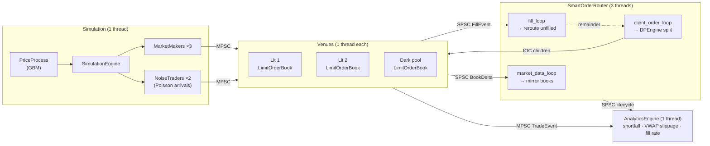

# High-Frequency Trading Smart Order Router

A multi-venue smart order router (SOR) in C++20, benchmarked against a naive
best-price baseline inside a purpose-built, agent-based market simulator.

The router decides **how to split a large parent order across competing venues** —
two lit exchanges and one dark pool — by solving a dynamic program over expected
execution cost, then works the order through IOC child orders and reroutes
whatever comes back unfilled.

Against a naive router that simply sweeps the venue showing the best price, the
DP router cuts implementation shortfall by **~75%** and pays **~40% less in fees**,
while filling more of the order.

[](https://github.com/Hamz714/High-Frequency-Trading-Smart-Order-Router/actions/workflows/ci.yml)

---

## Results

25 Monte Carlo trials × 6 parent orders × 2 arms (300 executions). Both arms run
against the same seeded market, so the only variable is the routing decision.

| Metric | SOR (DP) | Naive | Delta |
|---|---:|---:|---:|
| Implementation shortfall (bps) | **5.92** | 23.00 | **−17.08** |
| VWAP slippage (bps) | **6.07** | 22.08 | **−16.01** |
| Fill rate (%) | **96.92** | 92.69 | **+4.23** |
| Total fees ($) | **268.07** | 451.67 | **−183.60** |

Raw per-order data: [`results/baseline/sor_vs_naive.csv`](results/baseline/sor_vs_naive.csv).
Reproduce with `./high_frequency`.

The direction and magnitude hold across runs: over four runs the SOR's shortfall
landed between 4.3 and 5.9 bps against 23.0 to 26.3 bps for naive, a 74–82%
reduction, with fees consistently 41–44% lower. The tick-to-trade columns the
binary also prints are *not* stable, and the program says so in its own output —
see [Measurement honesty](#measurement-honesty).

### Order book microbenchmark

Single-threaded, 50k measured ops per scenario, no routing or threading involved.
Throughput is the median of 9 runs, with the observed range — a single pass on a
laptop is noisy enough that the ladder/overflow ratio can invert, so the tool
repeats and aggregates by default.

| Scenario | ops/sec (median) | range | p50 | p95 | p99 |
|---|---:|---:|---:|---:|---:|
| insert (ladder region) | **9.09 M** | 4.84 – 11.23 M | 100 ns | 100 ns | 200 ns |
| insert (overflow map region) | 6.94 M | 3.82 – 7.58 M | 100 ns | 200 ns | 200 ns |
| cancel (ladder region) | **18.71 M** | 14.07 – 20.62 M | 0 ns | 100 ns | 100 ns |
| cancel (overflow map region) | 12.62 M | 11.31 – 13.52 M | 100 ns | 100 ns | 100 ns |
| match (crossing, partial fill) | 10.10 M | 7.86 – 10.99 M | 100 ns | 100 ns | 100 ns |

Measured on an i7-1165G7 (4C/8T), Windows 11, GCC 14.2 `-O3`.
Raw data: [`results/baseline/lob_benchmark.csv`](results/baseline/lob_benchmark.csv).
Reproduce with `./bench_lob` (or `./bench_lob --repeat 25`).

The throughput column is the meaningful one. Windows `steady_clock` ticks at
~100 ns, so the per-op percentiles are quantised to that grid and should be read
as "at or below one clock tick", not as precise latencies. Throughput is measured
across all 50k ops at once and does not suffer from this.

---

## How the routing decision works

Splitting a parent order is an allocation problem: given `N` lots to place and
`V` venues, choose the allocation vector minimising total expected cost. The
router solves it exactly with a dynamic program rather than a greedy sweep,
because venue costs are **non-linear in size** — market impact grows
quadratically, so the marginal cost of the 500th share on a venue is not the
cost of the first.

`dp[k][n]` = minimum expected cost of placing `n` lots across the first `k`
venues. Lit venues are processed first so that their completed cost table can be
reused as the fallback for a dark-pool miss:

```
dp[k][n] = min over x in [0, n] of ( cost_k(x) + dp[k-1][n-x] )
```

**Lit venue cost** — half-spread, quadratic impact against visible liquidity,
per-share fees, and a latency penalty:

```
cost = half_spread·q  +  impact_coef·q²/visible_liquidity  +  fee·q  +  latency_us·λ
```

**Dark venue cost** — expected value over fill probability, where the miss branch
costs whatever it would take to fill that quantity on the lit book instead, plus
a delay penalty. Fill probability decays exponentially in size:

```
p_fill = historical_fill_ratio · exp(−decay_rate · q)
cost   = p_fill·(fee·q + latency)  +  (1 − p_fill)·(dp_lit[q] + λ·q)
```

This dark-pool term is the reason lit venues are solved first: `dp_lit` has to
already exist to price the miss branch.

Complexity is `O(V · W²)` for `W = N/lot_size + 1`. The tables are flattened to
row-major arrays and the previous row is pre-reversed, so the inner loop walks
two arrays forward instead of one forward and one backward — a materially better
access pattern than the naive `dp[k-1][n-x]` indexing.

The naive baseline it is measured against sends the entire order to whichever
lit venue currently shows the best price.

---

## Architecture

Every component runs on its own thread and communicates through bounded
lock-free ring buffers. Nothing on a hot path takes a lock; the router's mirror
books are guarded by a `shared_mutex` that readers hold only briefly.



Eight threads per trial, spawned and joined fresh each run.

| Component | Role |
|---|---|
| [`LimitOrderBook`](src/lob/LimitOrderBook.cpp) | Price-time priority book; hybrid ladder + overflow map |
| [`Venue`](src/lob/Venue.cpp) | Owns a book, matches on its own thread, publishes deltas and fills |
| [`DPEngine`](src/sor/DPEngine.cpp) | The allocation dynamic program and the naive baseline |
| [`SmartOrderRouter`](src/sor/SmartOrderRouter.cpp) | Mirror books, parent/child lifecycle, reroute cascade |
| [`AnalyticsEngine`](src/analytics/AnalyticsEngine.cpp) | Execution quality metrics, off the hot path |
| [`SPSCQueue`](include/common/SPSCQueue.h) / [`MPSCQueue`](include/common/MPSCQueue.h) | Bounded lock-free ring buffers with drop counters |
| [`SimulationEngine`](src/sim/SimulationEngine.cpp) | Drives a virtual clock, market makers, and noise traders |
| [`MonteCarloHarness`](src/harness/MonteCarloHarness.cpp) | Runs both arms over identical seeded markets |

### Order book design

Real books cluster almost all activity within a few ticks of the touch, so the
book uses a **256-tick circular ladder of fixed-size price levels around the
touch, plus a `std::map` overflow region** for everything outside that window.
Occupancy in the ladder is tracked by a 4-word bitmask, so finding the next
non-empty level is `__builtin_ctzll` on a 64-bit word rather than a tree walk.
Orders live in a slab with intrusive prev/next indices, so cancels are O(1)
unlinks with no allocation.

The benchmark above measures both regimes separately and is what justifies the
split: ladder cancels sustain **1.48×** the throughput of overflow-map cancels
with non-overlapping ranges across 9 runs, and ladder inserts **1.31×** with
ranges that do overlap. `bench_lob` prints which of the two it is rather than
quoting a bare ratio.

---

## Build and run

Requires CMake ≥ 3.16 and a C++20 compiler. Tests fetch GoogleTest, so the first
configure needs network access.

```bash
cmake -S . -B build
cmake --build build -j
```

The build defaults to `Release` when no build type is given — latency numbers
from an unoptimised binary are meaningless, so this is deliberate.

```bash
./build/high_frequency        # SOR vs naive Monte Carlo comparison
./build/high_frequency -v     # ...with a per-order report breakdown
./build/bench_lob             # order book microbenchmark
./build/calibrate             # randomised parameter sweep
```

Each writes a timestamped CSV into `results/`. The committed baselines in
`results/baseline/` are the runs quoted in this README.

### Tests

135 GoogleTest cases across the book, queues, router, DP engine, simulation
agents, and analytics.

```bash
ctest --test-dir build --output-on-failure
# or
./build/tests/unit_tests
```

The build is warning-clean under `-Wall -Wextra`.

### Calibration

Market and router parameters were not hand-picked. [`calibrate`](src/calibrate/main.cpp)
runs a randomised sweep over venue fees, latencies, impact coefficients, market
maker behaviour, and router tuning, scoring each configuration by the resulting
execution quality. The current [`SimConfig`](src/config/SimConfig.cpp) defaults
are the output of that search, which is why they are unrounded.

---

## Measurement honesty

A few things this project deliberately does not claim:

- **Tick-to-trade is not an algorithm benchmark.** The binary reports it, but it
  measures wall-clock submit→completion across eight threads that are spawned
  and joined per trial, on a loaded desktop OS. The SOR's multi-venue split and
  reroute cascade needs more cross-thread round trips than naive's single
  dispatch, so it looks *slower* on that metric by construction. The program
  prints this caveat itself rather than burying it. `bench_lob` is the clean,
  threading-free latency measurement.
- **Book percentiles are clock-limited**, as described above.
- **The simulator is not a market.** Prices follow geometric Brownian motion,
  market makers quote off a fair value with a volatility-sensitive spread, and
  noise traders arrive as a Poisson process with lognormal sizes. That is enough
  to make routing decisions matter and to differentiate the two strategies; it is
  not a claim of realism against live venue microstructure.
- **Dropped messages are surfaced, not hidden.** Every queue counts drops, the
  counts are rolled up across the object graph, and a non-zero total prints a
  warning that the run's metrics may be biased.

## License

MIT — see [LICENSE](LICENSE).
